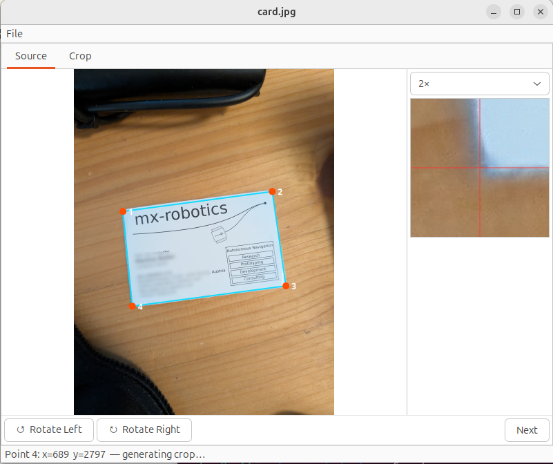
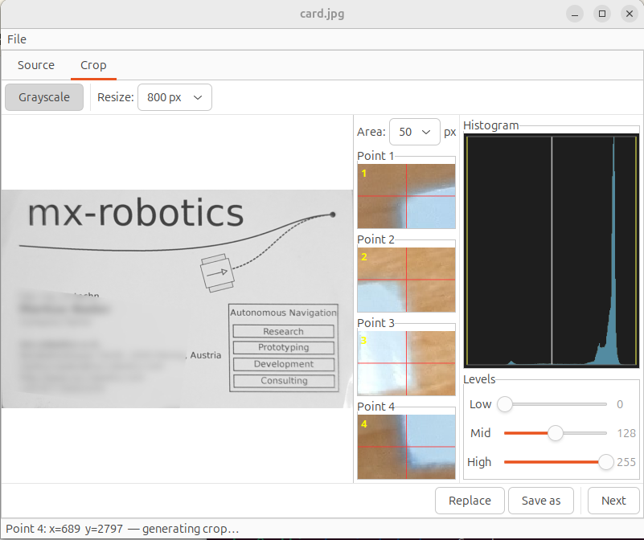

# entzerr

A lightweight GTK3 desktop tool for perspective correction of photographs — designed for digitising flat subjects like cards, notes, and documents that were photographed at an angle.




## Features

- Click 4 corner points on the source image to define the region of interest
- Perspective warp via inverse homography (bilinear interpolation)
- Zoom lens for precise point placement
- Fine-tune each corner by clicking inside its thumbnail
- Rotate the source image before picking points (90° CW / CCW)
- Crop tab: rotate output (0 / 90 / 180 / 270°), resize to a fixed width, grayscale toggle
- Levels adjustment (black point / midtone / white point) with live RGB histogram
- Save as a new file or replace the original in-place (original is backed up as `<name>-org.<ext>`)
- Navigate through images in the same folder with the **Next** button
- Accepts a filename on the command line: `entzerr photo.jpg`

## Dependencies

- GTK+ 3.0
- CMake ≥ 3.21

On Debian/Ubuntu:

```bash
sudo apt install cmake libgtk-3-dev
```

## Build

```bash
cmake --preset=release
cmake --build build/release
```

### Install

```bash
sudo cmake --install build/release
```

Installs the binary to `/usr/local/bin`, the desktop entry to the applications menu, and the icon to `/usr/local/share/pixmaps`.

### Debug build

```bash
cmake --preset=debug
cmake --build build/debug
./build/debug/entzerr
```

## Usage

1. Open an image via **File → Open** or pass it on the command line.
2. In the **Source** tab, click the 4 corners of the region you want to extract (in any order). The crop is computed automatically when the 4th point is placed and the **Crop** tab opens.
3. In the **Crop** tab, adjust rotation, resize, grayscale, and levels as needed.
4. Save with **Save as** (new file) or **Replace** (overwrites the original; original is preserved as `<name>-org.<ext>`).
5. Use **Next** to move to the next image in the directory.

## License

BSD 3-Clause — see [LICENSE](LICENSE).